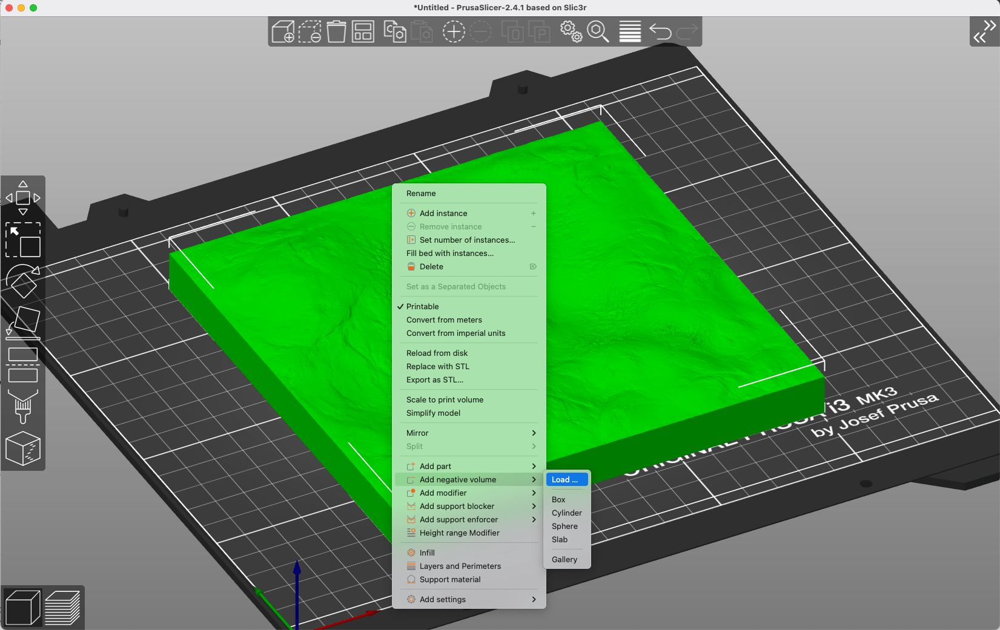

# Make gridded floors quick and easy

## About

Quick and easy instructions to make a gridded version of a terrain or floor tile for RPG or wargaming.

As an example I use Devon Jones' [OpenForge Tundra Terrain](https://www.patreon.com/posts/landscapes-iced-63189276).

1. Load your floor into PrusaSlicer
2. Right-click the loaded object and select "Add negative volume / Load ..."
	
3. Choose the attached ```grid.negative.6x6.inch.stl``` file
	
4. Click on the loaded grid (or select it in the sidebar to the right)
5. Raise it by 8 mm
	
6. Slice it
	
7. Print it
